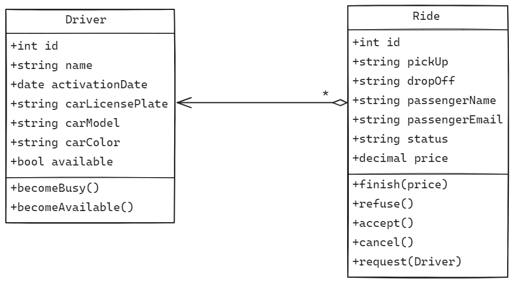

# DESAFIO 

## REFERÊNCIAS

- [DESAFIO](CHALLENGE.md)
- [MVP](MVP.md)
- [RELEASE](RELEASE.md)
- [POSTMAN COLLECTION](https://l3l3co.postman.co/workspace/New-Team-Workspace~d450d5e4-7c3a-4449-9f65-226a04a3389e/collection/414153-735bc628-c41e-478c-a2c4-d90be0758a1a?action=share&creator=414153&active-environment=414153-4adc1ab7-8041-4b2c-8241-002c5e9dcfa7)
  

## REPOSITÓRIOS BASES

- [NODE]()
- [KOTLIN](https://github.com/jaya-academy/ridely-kotlin)

## Problemas existentes 

- **Performance**
  - Falta de índices
  - findAll e obtem primeiro motorista em memória

- **Qualidade**
  - Falta testes
  - Design com muitas camadas desnecessárias
  - Aplicação de design patterns distorcidos
  - Bugs
    - Phantom write ao solicitar motorista

- **Segurança**
  - Não validar autenticidade do motorista
  - alterar status da corrida de outro motorista
  - vazamento de dados (motoristas e passageiros)

## O que vamos aprender?

- Arquitetura de soluções (com EC)
- Didática de código
  - Design de código
  - Gestão de código legado
- Design de API
- Segurança
- Estratégia de testes
